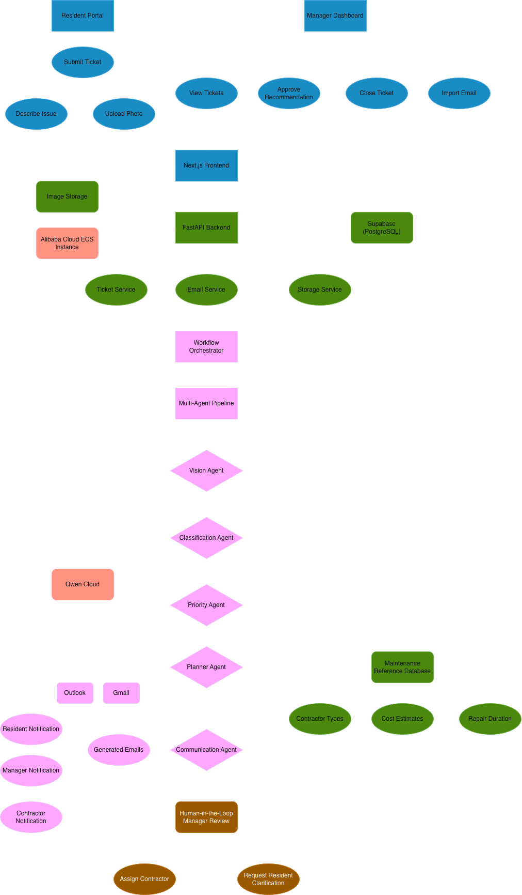

# mAIntAIn
## AI-Powered Property Maintenance Copilot

**Built for the Qwen Cloud Global AI Hackathon 2026**  
**Track 4 – Autopilot Agent**

---

## Overview

mAIntAIn is an AI-powered property maintenance copilot that automates the end-to-end workflow from maintenance request submission to contractor recommendation.

Using a multi-agent pipeline powered by **Qwen Cloud**, the system transforms unstructured text, images, and emails into structured maintenance plans while keeping property managers in control through human approval before any contractor is assigned.

---

## Why mAIntAIn?

Property managers spend significant time:

- Reviewing maintenance requests
- Interpreting uploaded images
- Assessing urgency
- Choosing contractors
- Drafting communications

mAIntAIn automates these repetitive tasks, enabling faster, more consistent decision-making while preserving human oversight.

---

# Key Features

### Resident Portal
- Submit maintenance requests
- Upload issue photographs
- Describe maintenance problems

### Email Import
- Import Outlook/Gmail maintenance emails
- Automatically extract contents and attachments
- Create maintenance tickets

### AI Multi-Agent Workflow
- **Vision Agent** – analyzes uploaded images
- **Classification Agent** – identifies maintenance category
- **Priority Agent** – assesses urgency and risk
- **Planner Agent** – recommends contractors, cost and duration
- **Communication Agent** – drafts messages for residents, managers and contractors

### Human-in-the-Loop
Managers can:
- Review AI recommendations
- Approve contractor assignments
- Request clarification
- Close completed cases

---

# Why This Fits Track 4

mAIntAIn automates a complete real-world business workflow:

**Resident Request / Email**
→ AI Analysis
→ Issue Classification
→ Priority Assessment
→ Repair Planning
→ Communication Generation
→ Human Approval
→ Contractor Assignment

The project demonstrates:

- ✅ End-to-end workflow automation
- ✅ Multi-agent orchestration
- ✅ Ambiguous text + image handling
- ✅ External service integration (Qwen Cloud)
- ✅ Human-in-the-loop checkpoints
- ✅ Production-oriented architecture

---

# Live Demo

| Service | URL |
|----------|-----|
| Frontend | http://47.237.102.151 |
| Backend API | http://47.237.102.151/docs |

---

# System Architecture



---

# Tech Stack

| Layer | Technology |
|--------|------------|
| Frontend | Next.js, React, TypeScript, Tailwind CSS |
| Backend | FastAPI, Python |
| Database | Supabase PostgreSQL |
| AI | Qwen Cloud (Qwen3.7-Plus) |
| Deployment | Alibaba Cloud ECS |

---

# Qwen Cloud Usage

mAIntAIn leverages Qwen Cloud throughout the maintenance workflow.

| Agent | Qwen Cloud Task |
|--------|-----------------|
| Vision Agent | Image understanding |
| Classification Agent | Issue categorization |
| Priority Agent | Urgency reasoning |
| Planner Agent | Repair planning |
| Communication Agent | Message generation |

---

# Repository Structure

```text
backend/
    agents/
    services/
    routes/
    models/
    database/

frontend/
    app/
    components/
    services/
```

---

# Running Locally

## Backend

```bash
cd backend

python -m venv .venv
source .venv/bin/activate

pip install -r requirements.txt

uvicorn main:app --reload
```

Backend:

```
http://127.0.0.1:8000
```

API Docs:

```
http://127.0.0.1:8000/docs
```

---

## Frontend

```bash
cd frontend

npm install

npm run dev
```

Frontend:

```
http://localhost:3000
```

---

# Environment Variables

Create a `.env` file inside **backend/**

```env
QWEN_API_KEY=your_qwen_api_key
DATABASE_URL=your_supabase_postgresql_url
```

Create a `.env.local` file inside **frontend/**

```env
NEXT_PUBLIC_API_URL=http://127.0.0.1:8000
```

---

# Alibaba Cloud Deployment

The application is deployed on an Alibaba Cloud Elastic Compute Service (ECS) Ubuntu instance.

Production deployment includes:

- Nginx reverse proxy
- Next.js production server
- FastAPI + Uvicorn
- systemd service management
- Supabase PostgreSQL
- Qwen Cloud APIs

Deployment-related configuration can be found under:

```text
backend/deployment/
    maintain.service
    maintain-frontend.service
    nginx.conf
    deploy.md
```

Core Qwen Cloud integrations are implemented under:

```text
backend/services/
```

---

# Demo Notes

For hackathon judging:

- Authentication has been intentionally omitted so judges can immediately access the application.
- Contractor recommendations use a curated demonstration dataset instead of live vendor integrations.

In production, the system would integrate with:
- Existing resident portals
- Enterprise authentication (SSO)
- Approved contractor databases

---

# Demo Video

YouTube:

```
<Insert Video URL>
```

---

# License

MIT License
